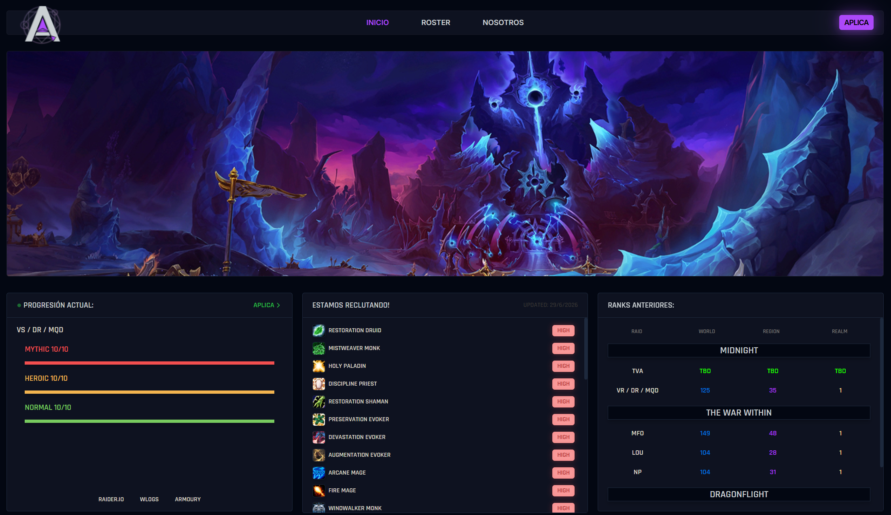
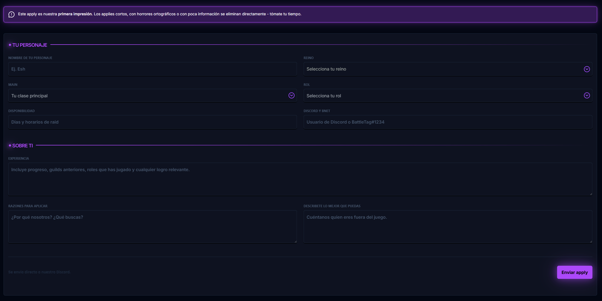
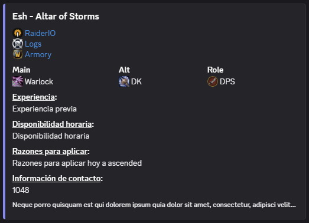

# 🌃 NightDrive

A modern full-stack web application built to explore clean UI design, scalable architecture, and modern web development practices.

## ✨ Features

- Responsive interface
- Modern component-based architecture
- Fast and intuitive user experience
- Clean, maintainable codebase

## 🛠️ Tech Stack

### Frontend
- React
- TypeScript
- Tailwind CSS

### Backend
- Node.js
- Express

### Database
- MongoDB

## 🚀 Getting Started

Clone the repository:

```bash
git clone https://github.com/wMageblood/nightdrive.git
```

Install dependencies:

```bash
npm install
```

Run the development server:

```bash
npm run dev
```

## 📌 Goals

NightDrive is a personal project focused on improving full-stack development skills while following modern development practices and creating polished user experiences.

## 📄 License

This project is available under the MIT License.






## Disclaimer

This is a fan-made project created for educational and portfolio purposes.

World of Warcraft®, Warcraft®, Blizzard Entertainment®, and all related names, logos, artwork, and assets are trademarks or registered trademarks of Blizzard Entertainment, Inc.

Raider.IO and Warcraft Logs are trademarks of their respective owners. This project is not affiliated with, endorsed by, or sponsored by Blizzard Entertainment, Raider.IO, or Warcraft Logs.

Character, progression, and performance data are provided by Blizzard and/or third-party services where applicable.